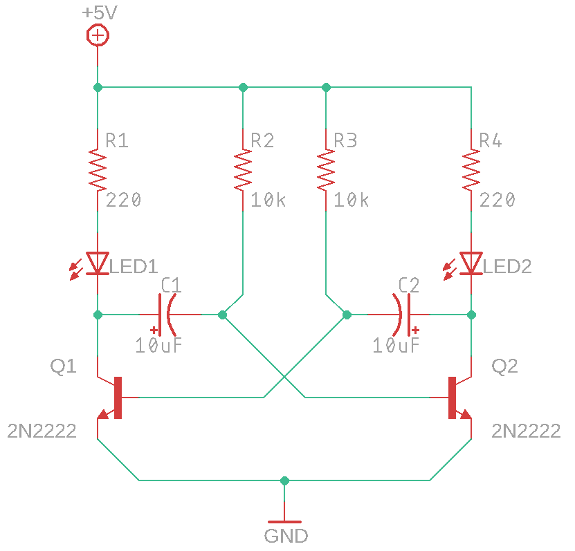

# Мультивибратор

> Нейминг: "Дискотека" "Робот моргУн" "вкыл/выкл" "Очень умный светильник" "Включатор/выключатор"

## О занятии

На этом занятии необходимо подвести ребят к тому, что транзисторы гораздо более полезные компоненты, особенно если особым образом к ним подключить конденсаторы и резисторы. В данном занятии большое поле для модификации схемы, так что с дополнительным заданиями особо можно не заморачиваться. А можно и полевой транзистор подключить с мотором! 

## План занятия

1. Узнать у ребят о домашнем задании
2. Рассказать ребятам в общих чертах о электротехнике и ее роли в робототехнике
3. По простому рассказать о мультивибраторе и его работе
4. Собрать схему 1
5. Собрать схему 2 \(поменять резистор/ы и конденсатор/ы\)
6. Собрать схему 3 \(подключить мотор ко всему этому безобразию\)
7. Дать домашнее задание

