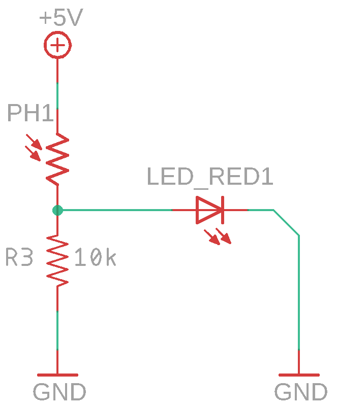

# Умный фонарь

## О занятии

В данном занятии необходимо изучить с ребятами такое устройство, как делитель напряжения

## План занятия

1. Узнаем о домашнем задании
2. Рассказываем ребятам о новом компоненте - переменном резисторе и его устройстве.
3. Делаем резистор собственноручно [http://gameforstreet.ru/dopolnitel-naya-shema-dlya-mikronika-amperka-sozdaem-rezistor/](http://gameforstreet.ru/dopolnitel-naya-shema-dlya-mikronika-amperka-sozdaem-rezistor/)
4. Коротко вспоминаем о "пирамидке" и даем понятие делителя напряжения
5. Собираем схему 1
6. Вспоминаем про глупый светильник и показываем схему умного светильника
7. Собираем схему 2
8. Даем домашнее задание

