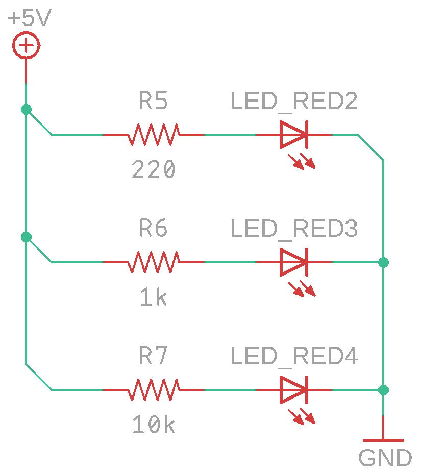
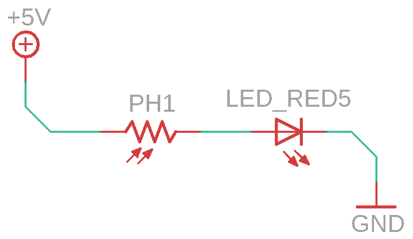

# Фонарь с регулировкой яркости

## О занятии

В данном занятии необходимо дать три основных понятия электротехники: сопротивление, напряжение и ток. Основной упор делается на сопротивление, ребята должны понять, что от сопротивления зависит ток в цепи и, как следствие, итоговая яркость светодиода.

## План занятия

1. Узнаем о домашнем задании
2. Рассказываем о таких понятиях, как напряжение, ток и сопротивление. Рисуем "пирамидку".
3. Рассказываем о резисторах, показываем какие они бывают
4. Собираем схему 1
5. Выясняем, почему с разными резисторами светодиоды горят по разному
6. Рассказываем о фоторезисторе
7. Собираем схему 2
8. Закрепляем занятие вопросами, получаем обратную связь.
9. Даем домашнее задание

