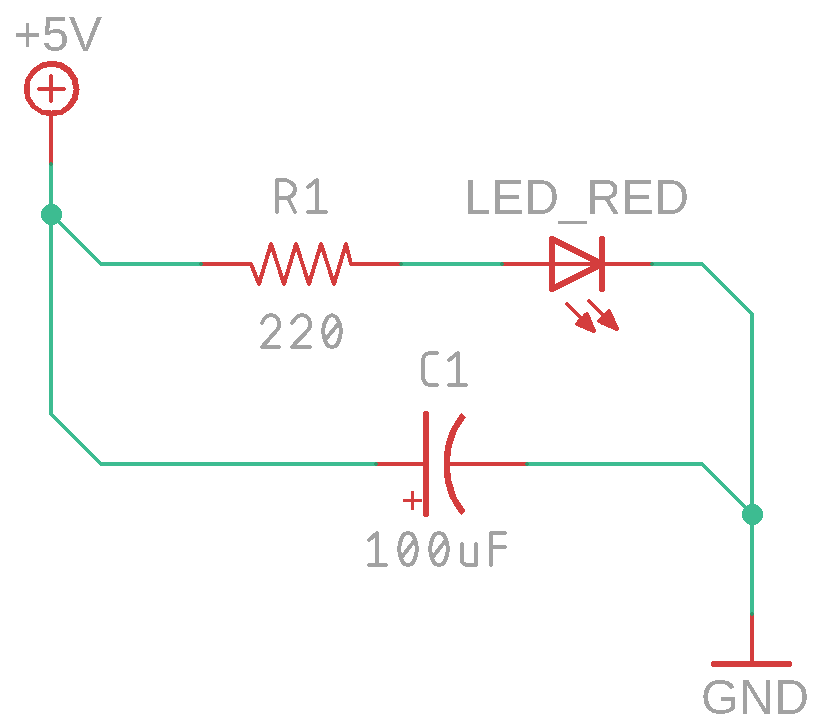
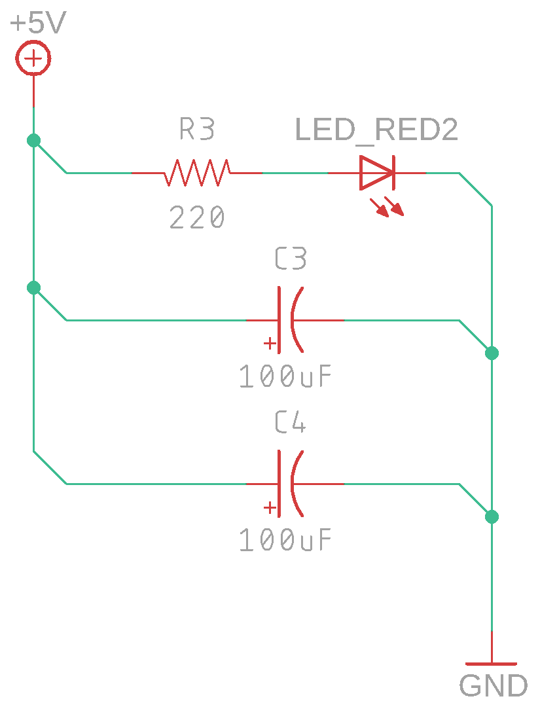

# Конденсатор

## О занятии

На этом занятии необходимо с ребятами изучить понятие ёмкости, процесс её заряда и разряда. Однако важно, что бы ребята ни в коем случае не восприняли ёмкость как аккумулятор. Необходимо провести четкую границу между двумя этими понятиями.

## План занятия

1. Узнаем у ребят о домашнем задании
2. Дать понятие о емкости в электрической цепи
3. Рассказать о конденсаторах и показать их
4. Объяснить разницу между конденсатором и аккумулятором
5. Собрать схему 1
6. Отключить питание и сформулировать что же произошло \(процесс разряда\)
7. Собрать схему 2
8. Понять как влияет изменение сопротивление резистора на работу схемы
9. Собрать схему 3
10. Понять, как влияет подключение дополнительных конденсаторов в цепь
11. Собрать схему 4
12. Изучить влияние резистора включенного последовательно с конденсатором \(процесс заряда\)
13. Собрать схему 5
14. Дать домашнее задание

