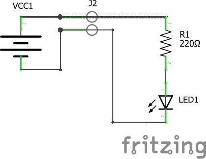
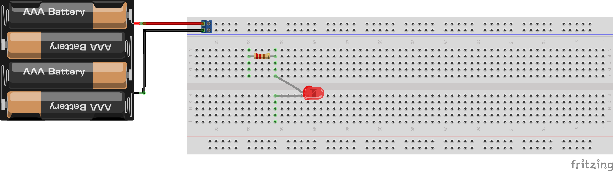
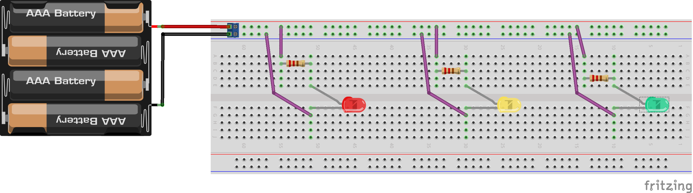
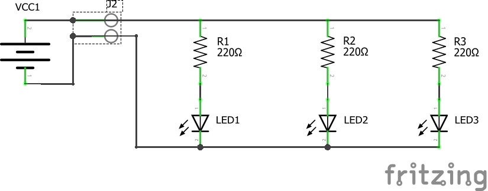

# Фонарь

> "Вы знаете зачем вы создали лампу накаливания? — Нет, но я думаю правительство скоро поймет, как брать с людей за это деньги!"
>
>                                     _— Томас Эдисон американский изобретатель и предприниматель 1847 - 1931_

## Компоненты

1. Светодиод \(любого цвета\)
2. Резистор 220 кОм
3. Макетная плата
4. Провода 
5. Блок питания

## Важные правила

* Не торопитесь, будьте очень внимательны. Электроника не любит торопыг!
* Соединение "+" и "-" блока питания приводит к короткому замыканию, последствия плачевны.
* Блок питания подключается в самом конце сборки, когда вся схема проверенна.

## Сборка

Для начала необходимо установить все компоненты на макетную плату. Находим все необходимые компоненты в наборе, и вперед!


Правый вывод резистора и длинный вывод светодиода должный быть в одном ряду.



Если вывод провода и компонента подключить в один ряд, то макетная плата их соединит!


Проверяем схему, подключаем блок питания...


Поздравляю! Ваша первая схема собрана.


## Вопросы

* Как работает макетная плата?
* Зачем нужен резистор?
* Что такое канавка?
* Какое напряжение на выходе блока питания?
* Что такое короткое замыкание?

## Дополнительные задания

1. Собрать два, а после три светодиода, сделать светофор
2. Собрать схему без проводов

## Решение

