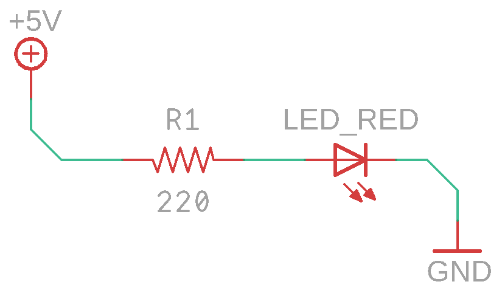
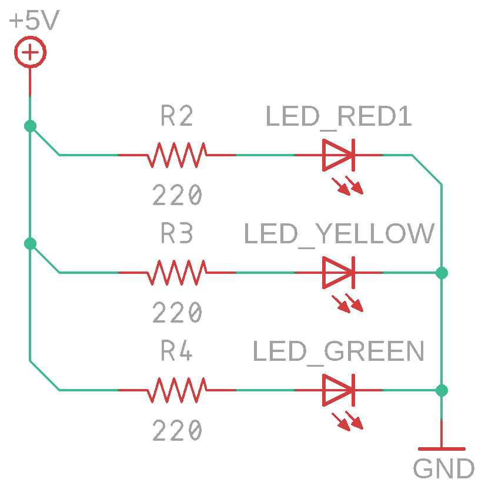

# Фонарь

[http://gameforstreet.ru/dopolnitel-naya-shema-dlya-mikronika-amperka-sozdaem-rezistor/](http://gameforstreet.ru/dopolnitel-naya-shema-dlya-mikronika-amperka-sozdaem-rezistor/)

## О занятии

Самое первое занятие с группой. Данное занятие больше несет организационный характер, чем педагогический. Оно самое сложное для преподавателя в плане организации самого занятия. 

Занятие должно пройти четко по плану, без заминок, времени будет крайне мало. Спешка - недопустима, все ребята должны всё успеть, не нужно проводить занятие по принципу "большая часть" -  когда 5 из 8 человек выполнили задачу, а остальные задерживаются.

Главная цель преподавателя - что бы все ребята успели выполнить все задачи, а преподаватель свои.

## План занятия \(задачи преподавателя\)

1. Познакомить ребят с курсом, клубом и правилами
2. Рассказать о электронных компонентах и распаковать набор
3. Рассказать о проводниках, и объяснить почему ток идет по металлу, а по пластмассе - нет
4. Рассказать о макетной плате и показать как она работает
5. Рассказать о блоке питания и установить на блок питания клеммник\(?\)
6. Рассказать о резисторе и светодиоде,  подготовить их к установке
7. Нарисовать компоненты на доске, и как их нужно соединить, дать понятие электрической цепи.
8. Собрать принципиальную схему №1
9. Собрать принципиальную схему №2 \(доп\)
10. Сложить набор обратно в коробку
11. Дать домашнее задание и поблагодарить за занятие

### О клубе, организации занятия, курсе обучения и правилах. Знакомство.

В первую очередь, необходимо рассказать ребятам о клубе:

`Наш клуб Тесла - назван в честь австрийского ученого и изобретателя Николы Теслы, жившего и работавшего целых 100 лет назад. Он придумал большое количество изобретений, принципами которых человечество пользуется до сих пор. Например, он придумал передавать энергию при помощи переменного тока, благодаря чему мы все до сих пор пользуемся бытовыми розетками.`

`Наш клуб Тесла - это место, где сотни ребят учатся как делать роботов и делают их! Причем именно таких работов, которых они придумывают сами! И вы, ребята, теперь часть нашего большого клуба, поздравляем!`

`В нашем клубе мы занимаемся серъезными вещами, используем настоящие компоненты, инструмены и приборы, не игрушечные. Из таких же компонентов делают всю элетронику - компьютеры, машины и ракеты. Именно поэтому в нашем клубе все по взрослому.`

`В связи с этим необходимо строго выполнять рекомендации преподавателя, ведь нередко роботы и устройства выходят из строя, и все это может закончится настоящими травмами и серъезными последствиями`

Далее нужно рассказать немного об организации:

`Ребята, для того, что бы записывать и не забывать придуманные и изобретенные Вами схемы, на каждом занятии Вам необходимо приносить с собой тетрадку и писчие принадлежности.`

`Занятие у нас с Вами будет длиться целых 2 часа, но это слишком много даже для меня, преподавателя, поэтому у нас с Вами будет специальный перерыв, на котором мы с Вами будем пить чай с печеньем, а что бы Вам не было скучно, я буду рассказывать новости из мира робототехники и техники.`

Затем рассказываем о курсе обучения:

`Для того чтобы строить роботов, нам с Вами предстоит изучить базовый курс, стоящий из трех больших разделов, а именно:`

* Электроника
* Механика
* Программирование

`Затем у нас начнется интереснейший этап - собственные проекты. На этом этапе Вы начнете проектировать и создавать своих собственных роботов, но перед этим мы должны изучить базовый курс, без которого создание собственных роботов - невозможно.` 

И заканчиваем правилами:

`Теперь расскажу Вам немного о правилах. В нашем клубе правила не такие как у Вас были в детском саду или школе. Правила общественного порядка нужно соблюдать неукоснительно, никаких драк и оскорблений быть не должно, за любое нарушение такого вида наказание простое - исключение из клуба, без возможности вернуться обратно. Прежде чем совершать такие поступки вспомните, как сложно Вам было попасть в наш клуб.`

`Правила нашего клуба достаточно простые:`

1. "Инженер - помощник для всего мира". Инженеры друг друга в беде не бросают. Поэтому мы все друг другу помогаем. И не важно это твой близкий друг или человек, которого ты видишь впервые. Теперь вы все - инженеры - помощники для всего мира.                                                                                        
2. "Внимание" - волшебное слово, услышав его от преподавателя нужно отвлечься, посмотреть на преподавателя и послушать, что он скажет.                                                                                        P.S Используется только преподавателем и только в особых случаях.
3. "Только вперед" - не останавливаться на достигнутом, даже преподаватели  развиваются и постоянно разрабатывают новые проекты.

### О радиоэлектронных компонентах и наборе

`Задаем вопросы:                                                                       Ребята, а из чего состоят всеразличные окружающие Вас механизмы? А мы с вами из чего состоим? А их чего состоят роботы? (поддерживаем диалог, даем всем высказаться)`

`Правильно, ребята, роботы состоят из различных компонентов, одни компоненты - элетронные(резисторы, ранзисторы, экраны, батарейки), а другие - механические(шестеренки, рычаги, элементы корпуса).` 

`Изучение робототехники начнается с изучения электроники, в этом нам с Вами помогут наборы "Теслёнок"`

Раздаем ребятам их наборы

`Наборы "Теслёнок" помогут нам с Вами изучить электронику. Давайте же посмотрим, что там внутри? (ребята открывают наборы и видят кучу пакетиков).`

`Что вы видите, ребята? ("пакетики","какие-то штуки","детальки"). На самом деле все, что вы видите перед собой это и есть компоненты настоящих роботов. Есть одна очень важная особенность, инженеры не используют таких слов, как: "дырка", "фиговина", "деталька". "Дырка" - это отверстие, "фиговина" - макетная плата, "деталька" - резистор`

Задание на дом: пересчитать все компоненты, проверить их полное наличие и подписать набор.

### О проводниках и течении электрического тока

`Ребята, а кто из вас знает из чего делают электрические провода? (из металла отвечаю они) А почему именно из металла? (затрудняются ответить)`    

`Дело в том, что электрическому току проще всего двигаться по металлам. Так же, как поезду проще передвигаться по рельсам, чем по асфальту. Поэтому наша с вами задача будет заключаться в построении пути, для электрического ТОКА, что бы он смог через КОМПОНЕНТЫ по металлическим ПРОВОДНИКАМ пройти от ПЛЮСА к МИНУСУ. Поэтому, что бы соединить компоненты, нам понадобится многов проводников!`

### О макетной плате и её работе

`А теперь давайте с Вами найдем в нашем наборе самый необходимый компонент для сборки наших экспериментов - макетную плату. (показываем макетную плату и ждем когда все ребята её достанут)`  

`Вообще в настоящих роботах и электронных устройствах для соединения все различных компонентов используются печатные платы (показать печатные платы), однако на время изучения мы с вами будем использовать не печатную плату, а макетную, что позволит нам создать готовое устройство всего за одно занятие! Когда для создания печатной платы нам бы потербовались недели плотной работы. Однако помните, что для более сложных проектов нужно использовать печатные платы, а не макетные!`

`Итак, ребята, это - макетная плата. Снаружи мы с вами видим очень много отверствий и центральную канавку. А вот внутри`

## Компоненты

1. Светодиод \(любого цвета\)
2. Резистор 220 кОм
3. Макетная плата
4. Провода 
5. Блок питания
6. Лист бумаги
7. Простой мягкий карандаш





## Важные правила

* Не торопитесь, будьте очень внимательны. Электроника не любит торопыг!
* Соединение "+" и "-" блока питания приводит к короткому замыканию, последствия плачевны.
* Блок питания подключается в самом конце сборки, когда вся схема проверенна.

## Сборка

Для начала необходимо установить все компоненты на макетную плату. Находим все необходимые компоненты в наборе, и вперед!


Правый вывод резистора и длинный вывод светодиода должный быть в одном ряду.



Если вывод провода и компонента подключить в один ряд, то макетная плата их соединит!


Проверяем схему, подключаем блок питания...


Поздравляю! Ваша первая схема собрана.


## Вопросы

* Как работает макетная плата?
* Зачем нужен резистор?
* Что такое канавка?
* Какое напряжение на выходе блока питания?
* Что такое короткое замыкание?

## Дополнительные задания

1. Собрать два, а после три светодиода, сделать светофор
2. Собрать схему без проводов

### nbmfnbfgmd

dsflgknnfdgn


fs,gnf.,gnm,df


> fdgfdgkldfgjdflkg
>
> sdjghfkjghkdfj

```cpp
kfjgfkjghkcxnxvncxlvk
dsfdsfdsfjnxzcv
dsfjndsljv
void main()
{}

```

## Решение

