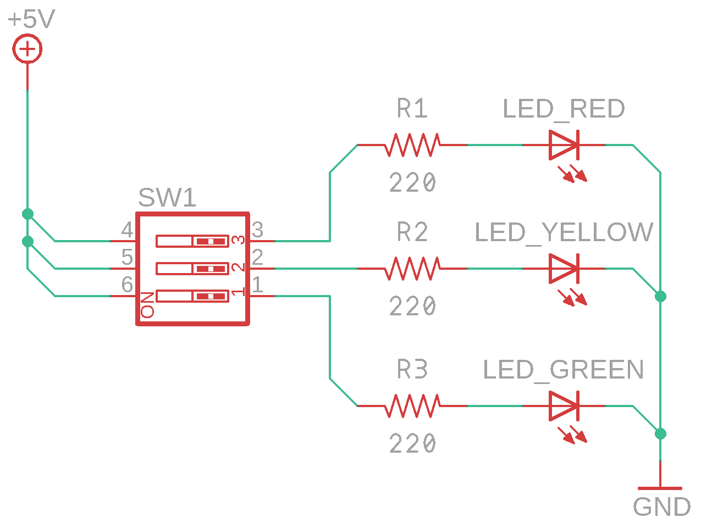

# Светофор

## О занятии

В данном занятии продолжаем изучать три основных понятия электротехники. На этот раз необходимо изучить такое понятие как напряжение. Для этого понадобится мультиметр.

Основная идея заключается  в том, что в зависимости от цвета светодиода на нем падает разное напряжение. 

Ребята должны понять, что изменяя сопротивление - меняется ток, а изменение тока - влияет на напряжение. Это необходимо для усвоения последующего устройства - делителя напряжения.

## План занятия

1. Узнаем о домашнем задании
2. Рассказываем о новом компоненте - переключателе
3. Напоминаем ребятам что такое напряжение, вспоминаем про "пирамидку"
4. Даем понятие диода и светодиода
5. Собираем схему 1
6. Рассказываем ребятам о мультиметре
7. Измеряем напряжения на светодиодах
8. Измеряем сопротивление резисторов
9. Даем домашнее задание

