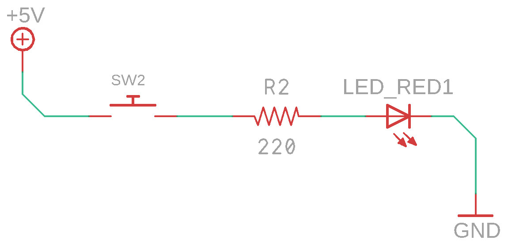

<<<<<<< HEAD
---
description: из микроника
---

# Телеграф

=======
---
description: Тактовая кнопка. Передача информации. Азбука морзе.
---

# Телеграф

> Нейминг: "Телеграф", "Связист", "Пшш... Первый.... Как слышно?"

## О занятии

В этом занятии необходимо дать ребятам представление о передачи информации. В общих чертах объяснить, как при помощи электрических явлений передается информация. Что такое вообще информация.

## План занятия

1. Узнаем у ребят о домашнем задании
2. Объяснить что такое информация и как ее можно передавать.
3. Рассказать о тактовой кнопке и ее устройстве
4. Пояснить как можно применить тактовую кнопку для передачи информации \(азбука морзе\)
5. Собрать схему 1
6. Попробовать зашифровать сообщение при помощи азбуки морзе и передать ее коллеге инженеру
7. Напомнить о конденсаторах и собрать схему 2
8. Провести эксперимент с длинной витой парой \(если есть возможность / витая пара\)
9. Дать домашнее задание

>>>>>>> f7446b91c112eb8323d611109bb8d3803f14afa5
